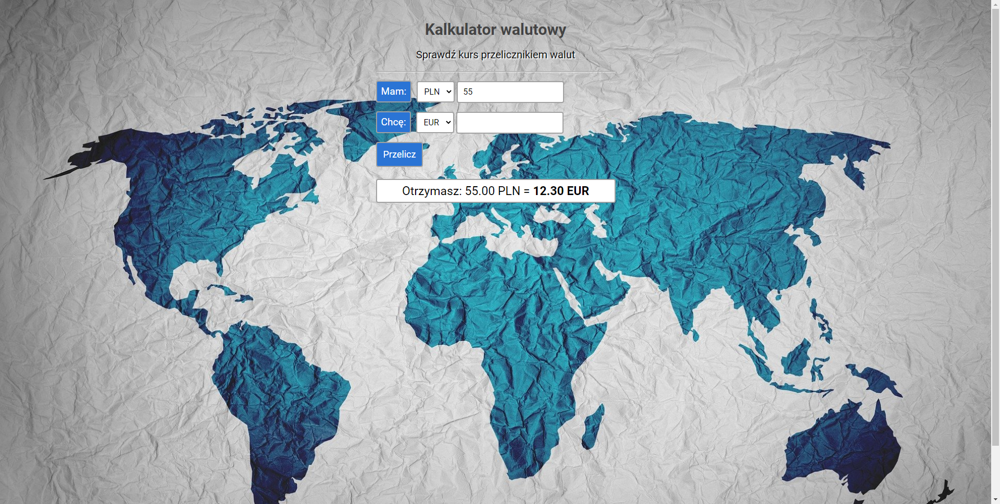

# Currency exchange
This is a currency exchange made as part of the Junior Frontend Developer course in You Code. The currency exchange converts PLN into USD, EUR or GEL currencies.

## Table of contents
* [Screenshots](#screenshots)
* [Technologies](#technologies)
* [Setup](#setup)
* [Features](#features)
* [Status](#status)
* [Contact](#contact)


## Screenshots


## Technologies
* HTML 
* CSS 
* Java Script - (ES6+)

## Setup
https://ula-firek.github.io/currency-exchange/

## Code Examples
```JavaScript
let formElement = document.querySelector(".js-form")
let amountElement = document.querySelector(".js-amount")
let currencyElement = document.querySelector(".js-currency")
let resultElement = document.querySelector(".js-result")


let rateUSD = 3.9689;
let rateEUR = 4.4710;
let rateGEL = 1.2879;

formElement.addEventListener("submit", (event) => {
    event.preventDefault();


    let amount = +amountElement.value;
    let currency = currencyElement.value;

    let result;

    switch (currency) {
        case "USD":
            result = amount / rateUSD
            break;
        case "EUR":
            result = amount / rateEUR
            break;
        case "GEL":
            result = amount / rateGEL
            break;
    }

    resultElement.innerHTML = `Otrzymasz: ${amount.toFixed(2)} PLN = <strong> ${result.toFixed(2)} ${currency}</strong>`;
});
```

## Features

* Adding a switch function
* Downloading current exchange rates via API
* Writing the result of the second currency in the second currency input


## Status
Project is: _in progress_ - the You Code course is in progress


## Contact
Created by ula.firek@gmail.com - feel free to contact me!
